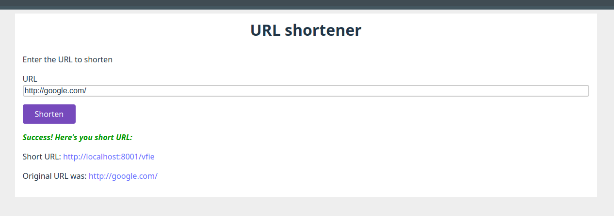

# What it it?

This is very basic "url shortener" - a typical educational exercise and a good coding interview task/question.

# Why and how?

This app has been written as a part of educational exercise.

It has been created as PoC to show basic frontend + backend + database + docker.

Everything is basic, simple, there is zero rocket science.

The idea is to follow basic advice as per oficial tutorials, guides and documentation in `February 2025`. E.g. I googled for a phrase "start simple Typescript React app in 2025", I looked for 10 minutes for different approaches and followed one of most basic one. Of course, please consider I've been coding for more than 20 years, so **it was not about learning** "how to build react apps"...

## Details:
- TS: used **TypeScript** that was "latest" at the time
- LIBS: all dependencies have been installed as "latest"
- AI: github copilot was turned on in my IDE - it was helpful when generating comments and some obvious code, but in most of the code was written manually
- Database: 
  - I picked MongoDB
- Backend - minimal use of libraries
  - pure **express**
  - pure **MongoDB** driver was used
- Frontend: 
  - **React**, Vite (more below, in the "Frontend section")
  - No UI framework
- Tests
  - bad practice alert: zero tests present

# Ports

The backend/frontend run on:
- BE: 8001
- FE: 8002

However "vite" is also configured as proxy, so that hitting `/api` will work on both ports.

# Database

Start mongoDB by running:
```
docker compose up
```
in the root folder.

You can kill it by hitting CTRL^C.

## Explanation (if you're new to docker)

Docker will look into `docker-compose.yml` file. Docker will find that "mongo" container needs to be started.

Then it will download all `mongo` docker "layers" from docker hub and run mongoDB inside the container.

The port `27017` will be exposed from the insider of the container, so that the application can hit 27017 to talk to MongoDB. The port number is explicitly given in the configuration in the `docker-compose.yml` file.

# Frontend

This app was created with 
```
npm create vite@latest
```
as a starting point.
I picked `Typescript + SWC` in configuration.

> Note: CRA (Create React App) is deprecated (according to their own website) and React homepage advice is to use any of the existing frameworks.

# Backend

It's pure node.js + Express. It uses nanoid to generate nice-looking shortened URLs.

# How to run it

Short version:
- start the database
- install node packages, compile and run. You have to do it twice, for frontend and for backend.

## All steps to run

### 1 - DATABASE
Open a new terminal and start mongoDB by running:
```
docker compose up
```
in the root folder.

### 2 - BACKEND
Open a new terminal and go to /be, install packages, compile the Typescript and run the server:
```
cd be
npm ci
npm run tsc
npm run start
```

When started it should say something like this:
```
> be@1.0.0 start
> node dist/server.mjs

{
  eventType: 'mongoConnecting',
  url: 'mongodb://localhost:27017',
  connectOptions: { connectTimeoutMS: 3000, serverSelectionTimeoutMS: 3000 }
}
{ eventType: 'mongoConnected', url: 'mongodb://localhost:27017' }
{ eventType: 'mongoUseDb', dbName: 'urlShortener' }
{ eventType: 'serverListening', port: 8001 }
```
You can test it by hitting POST request at `http://127.0.0.1:8002/api/addUrl` with something like this:
```
{
	"originalUrl": "https://onet.pl"
}
```

### 3 - FRONTEND

Open a new terminal and go to /fe, install packages, run the vite dev server (note: the Typescript code will be compiled by vite automatically):

```
cd fe
npm ci
npm run dev
```

It will say something like:
```
  VITE v6.1.0  ready in 139 ms

  ➜  Local:   http://localhost:8002/
  ➜  Network: use --host to expose
  ➜  press h + enter to show help
```

### 4 - The app itself

Open the browser at the http://localhost:8002/

It should look like that:
[](docs/screenshot.png)
